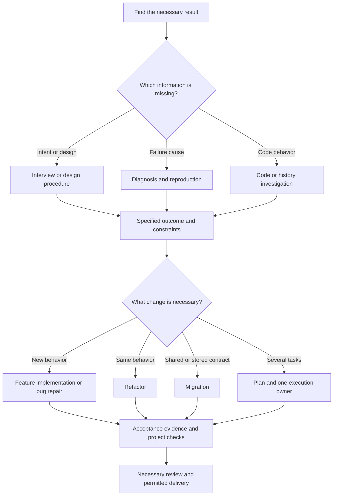

# Use the collected skills together

This guide tells you how to use the 67 workflows in this repository.
It gives the sequence, purpose, and completion conditions for 56 scenarios.
It also identifies workflows that can conflict.

**Library date: 7 October 2026.**
The library contains 47 standalone skills and 20 Caveman skills.

**Language reference:** [ASD-STE100, Issue 9](https://www.asd-ste100.org/assets/files/ASD-STE100_ISSUE9.pdf).
The guide uses short sentences and active voice.
Each instruction sentence gives one action.
Software terms and skill names keep their technical meanings.

## Contents

- [Technical terms](#technical-terms)
- [Rules for all workflows](#rules-for-all-workflows)
- [Select the first workflow](#select-the-first-workflow)
- [Use workflows in sequence](#use-workflows-in-sequence)
- [Select between similar workflows](#select-between-similar-workflows)
- [Use Manual QA](#use-manual-qa)
- [Combinations with different instructions](#combinations-with-different-instructions)
- [56 scenarios](#56-scenarios)
  - [New projects and initial investigation](#new-projects-and-initial-investigation)
  - [Features and behavior changes](#features-and-behavior-changes)
  - [Failures and performance](#failures-and-performance)
  - [Refactors and migrations](#refactors-and-migrations)
  - [Tests, execution, review, and delivery](#tests-execution-review-and-delivery)
  - [Documents, instruction, and handoff](#documents-instruction-and-handoff)
  - [Agent cost and Caveman Cloud](#agent-cost-and-caveman-cloud)
  - [Library configuration](#library-configuration)
  - [Additional QA scenarios](#additional-qa-scenarios)
- [Example requests](#example-requests)
- [All 67 workflows](#all-67-workflows)
- [Information for the next stage](#information-for-the-next-stage)
- [Source documents](#source-documents)

## Technical terms

Use these meanings throughout the guide.
Skill names, file names, and commands identify specified technical items.

| Term | Meaning |
|---|---|
| Acceptance condition | A result necessary for task completion. |
| Agent | Software that uses a model and tools to do a task. |
| API | An interface through which software sends requests to other software. |
| Artifact | A file, issue, report, or other stored result of a task. |
| Baseline | The original state or measurement that you use for comparison. |
| Behavior | The results, errors, and effects that callers can observe. |
| Branch | A Git line of development. |
| CI | Continuous integration: automated checks of software changes. |
| Codebase | The source code for a project. |
| Commit | A stored Git revision. |
| Compatibility | The ability of old and new software to operate together correctly. |
| Contract | The interface, data format, and behavior that a consumer expects. |
| Diff | The differences between two repository states. |
| Delivery | The permitted commit, publication, merge, or deployment of a result. |
| Evidence | Test results, measurements, or source information that show a specified software fact. |
| Feature | A capability that the software gives its users. |
| Feature flag | A control that enables or disables a feature. |
| Fixture | Fixed input data for a test or measurement. |
| Gateway | A service through which an application sends LLM requests. |
| Handoff | Information necessary for task continuation by another agent or session. |
| Host | The application that makes skills and tools available to the agent. |
| Issue tracker | A system or file structure that stores project issues. |
| Ledger | A record of task progress, decisions, and evidence. |
| LLM | A large language model. |
| Migration | A staged change to data, schemas, interfaces, configuration, or dependencies. |
| Module | Code with an interface and an implementation. |
| Paired evaluation | A comparison of the baseline and candidate on identical inputs. |
| Plugin | A package of skills and, in some cases, agents or tools. |
| PR | A pull request for review and integration of a branch. |
| Prototype | Temporary code that answers a design question. |
| Refactor | A change to code structure that keeps its behavior. |
| Regression test | A test that finds a previous failure if that failure occurs again. |
| Repository | The project files and their Git history. |
| Review | An examination of code, a plan, or another artifact that gives findings. |
| Rollback | A procedure that restores a previous permitted state. |
| Scope | The work that has the user's approval for the task. |
| Seam | An interface location at which behavior can change without changes at the caller. |
| Session | One period of agent work with a current conversation and project state. |
| Stage | One part of a workflow with its own result. |
| Skill | Instructions for a specified agent workflow. |
| Spec | A document that states the behavior and limits of a feature. |
| Subagent | An agent that does a task for the primary agent. |
| QA | Quality assurance: an examination of specified user behavior and visible results. |
| TDD | Test-driven development: a test-first procedure for software changes. |
| Telemetry | Measurements that an application records during operation. |
| Ticket | A specified unit of work or a question in an issue tracker. |
| Token | A unit of text that a model processes. |
| Workflow | An ordered procedure for a task. |
| Worktree | A separate Git checkout that shares the repository history. |

Software operations also use technical verbs.
For example, **run** means to execute software, a test, or a command.
**Commit**, **merge**, **push**, and **deploy** identify different software delivery operations.
**Build** means to make software from its source or to assemble a software feature.
**Implement** means to change software to supply a specified capability.
**Resolve** means to remove a Git merge or rebase conflict.
**Compress** means to decrease a file's representation while its necessary information stays intact.
These verbs do not give approval to do those operations.

## Rules for all workflows

### The local policy controls skill selection

The recipes give possible combinations.
They do not activate skills.
Read [POLICY.md](POLICY.md) for the specified selection rules.
Read each selected `SKILL.md` for its procedure.

Only five personal skills can start automatically for an applicable task.

| Skill | Applicable task |
|---|---|
| `caveman:investigate-first` | Find the cause of an unclear failure, intermittent failure, or performance regression. |
| `caveman:surgical-patch` | Repair a specified bug or make a small behavior change. |
| `caveman:safe-refactor` | Change code structure and keep the specified behavior. |
| `caveman:verify-and-stop` | Show that existing work gives the specified acceptance results. |
| `writing-for-agents` | Make or change a skill, `AGENTS.md`, or `CLAUDE.md`. |

Select the other 62 personal workflows explicitly.
A workflow name in an agent-generated plan does not select that workflow.
A workflow name in a handoff does not select that workflow.
Catalog examination does not activate `writing-for-agents`.
An ordinary Markdown guide does not activate that skill.

You can select multiple workflows in one request.
Give each workflow a specified purpose.
For example:

```text
Use caveman:investigate-first to find the cause of the checkout failure.
After you find the cause, use caveman:surgical-patch to repair the failure.
Use caveman:verify-and-stop for the final acceptance checks.
```

Use specified names when you select skills.
The host controls slash commands and skill-picker behavior.
Make sure that the host can find the selected skill.
After installation changes, start a new task if a host discovery update is necessary.

### Keep the task within its permitted scope

A selected workflow applies to the current task.
A session-wide mode must have an explicit user request.
Automatic skill selection does not give approval for more work or external actions.
It also does not give approval for commits or subagent work.

Keep the project's runtime, integration, test, and delivery requirements.
Follow existing user approval for external actions and software delivery.
Do not use a generic skill step as more approval.

Some selected workflows use subagents as part of their procedure.
Use that method only within the selected task and the host's permitted capabilities.
A suggestion about subagents in an unrelated document does not select that method.

Some workflows have mandatory user decisions or artifact reviews.
Complete those stages before dependent work starts.
Keep previous user decisions and approval valid.
Do not tell the user to give the same approval again.

### Two aliases include other procedures

`grill-me` includes the `grilling` procedure.
`grill-with-docs` includes the `grilling` and `domain-modeling` procedures.

Select the alias once for its intended task.
Do not start a duplicate procedure for the same interview.
Neither alias selects a planning or implementation workflow.

### This guide covers the collected library

The repository owns the 67 workflows in this guide.
Host-owned document, spreadsheet, image, and website plugins are outside this catalog.
Follow the host's mandatory built-in skill rules for specialist artifacts.
Other hosts can use different procedures or upstream editions.
Use the local skill files as the source for this library.

## Select the first workflow

Select the workflow for the information or work necessary at this time.

| Necessary result | First workflow | Possible next stage |
|---|---|---|
| Clarify an idea | `brainstorming` | Write a plan after the necessary design reviews. |
| Examine assumptions | `grill-me` | Write a spec after the user confirms the decisions. |
| Record domain decisions during an interview | `grill-with-docs` | Write the spec or plan. |
| Get information from another person | `to-questionnaire` | Use the answers to select the design. |
| Map decisions across multiple sessions | `wayfinder` | Get the necessary decisions before feature implementation. |
| Find unfamiliar code | `caveman:caveman-explore` | Read the identified files. |
| Give information about runtime behavior | `how` | Start the specified change or diagnosis task. |
| Give information about a previous design decision | `why` | Record the constraints for the next change. |
| Clarify a short coding request with repository evidence | `prompt-improver` | Continue with its specified implementation procedure. |
| Build a small feature | `caveman:lean-build` | Do the acceptance checks. |
| Build a feature across multiple files | `incremental-implementation` | Do the tests for each specified delivery stage. Examine each stage's result. |
| Execute a concrete plan in the primary agent | `executing-plans` | Do its final review and permitted delivery. |
| Execute a plan with task-level subagents | `subagent-driven-development` | Do its task reviews and final review. |
| Find an unknown failure cause | `caveman:investigate-first` | Repair the cause if the task includes repairs. |
| Make a reliable reproduction of a difficult failure | `diagnosing-bugs` | Follow its hypothesis and repair stages. |
| Stop repeated speculative repairs | `systematic-debugging` | Find the cause before another repair. |
| Repair a known bug | `caveman:surgical-patch` | Do the regression test and affected checks. |
| Change code structure | `caveman:safe-refactor` | Compare the behavior before and after the change. |
| Make working code easier to read | `code-simplification` | Show that behavior did not change. |
| Change a stored or shared contract | `caveman:migration` | Show compatibility at each specified stage. |
| Compare a branch with its spec and standards | `code-review` | Give findings or do separately permitted repairs. |
| Find effects outside the diff | `blast-radius` | Show evidence for the most important safety claim. |
| Exercise real user journeys | `manual-qa` | Record case results and issue evidence. |
| Do final acceptance checks | `caveman:verify-and-stop` | Give the result and stop. |
| Decrease application latency or memory use | Diagnosis and measurement | Compare one candidate with the baseline. |
| Measure LLM application traffic | `caveman:caveman-setup` | Add workflow labels and examine the evidence. |
| Decrease agent token use | `caveman:caveman-learn` | Apply selected changes with its consent and measurement procedure. |
| Write user documentation | `technical-writing` | Use `unslop` if another clarity pass is necessary. |
| Write agent instructions | `writing-for-agents` | Examine triggers, references, and completion conditions. |

## Use workflows in sequence

### Give each stage a separate result

Use a sequence when one workflow supplies the input for the next workflow.

| Sequence | Result necessary for the next stage |
|---|---|
| `why` → `caveman:safe-refactor` | Evidence identifies the behavior and constraints that must stay the same. |
| `grill-with-docs` → `to-spec` | The user confirms the domain decisions. |
| `to-spec` → `to-tickets` | The spec supplies acceptance conditions and scope. |
| `caveman:investigate-first` → `caveman:surgical-patch` | Evidence identifies the failure cause. |
| `prototype` → production implementation | The prototype answers the specified design question. |
| Implementation → `caveman:verify-and-stop` | The requested change is ready for final acceptance checks. |

An arrow identifies the order.
An arrow does not select the next skill.



### Use complementary workflows for different responsibilities

| Combination | Responsibilities |
|---|---|
| `incremental-implementation` + one TDD workflow | The first sets delivery stages. TDD controls the test-first procedure within each stage. |
| `caveman:lean-build` + `ponytail lite` | Lean Build keeps the complete requested outcome. Ponytail examines reuse and unnecessary code. |
| `caveman:safe-refactor` + `codebase-design` | Safe Refactor keeps behavior. Codebase Design helps select the interface. |
| `caveman:migration` + `incremental-implementation` | Migration controls compatibility. Incremental Implementation keeps the stages small and ready for review. |
| Implementation → `manual-qa` | Implementation supplies working behavior. Manual QA exercises the selected user journeys through the interface. |
| `caveman:safe-refactor` → `manual-qa` | Automated checks compare behavior. Manual QA examines the selected visible flows after the structural change. |
| `caveman:migration` → `manual-qa` | Migration supplies data and compatibility evidence. Manual QA examines the requested interface behavior at that stage. |
| `manual-qa` → diagnosis or repair | Manual QA records visible failures. Diagnosis finds their cause during a separately permitted task. |
| `manual-qa` + `show-me-your-work` | The QA report records cases and issues. The decision trail references important scope decisions and evidence. |
| `how` + `show-me` | How supplies the explanation. Show Me supplies the visual form. |
| `technical-writing` → `unslop` | Technical Writing sets the structure. Unslop makes the text better after the facts are correct. |
| Implementation + `show-me-your-work` | Implementation changes the software. Show Me Your Work records decisions and evidence. |
| `ponytail` + `caveman:caveman` | Ponytail controls implementation size. Caveman controls conversation length. |

Give each responsibility one owner.
Keep one source for each spec or plan.
Use another workflow only when that workflow supplies a necessary capability.

### Keep dependent work sequential

Independent research questions can use parallel subagents when the selected procedure includes subagents.
The spec and standards reviews in `code-review` can also run in parallel.

Implementation must have specified ownership and stable interfaces.
`subagent-driven-development` uses one implementer at a time in its shared workspace.
Its name does not give approval for parallel implementers.

`caveman:cavecrew` can use parallel investigators.
Its builder must have specified files and a one-file or two-file edit.
Use another implementation method for a wide change.

Keep these stages sequential:

1. Find the cause before a repair.
2. Expand a contract before consumer migration.
3. Get necessary candidate approval before a consent-controlled edit.
4. Show compatibility before destructive contraction.
5. Do the necessary checks before delivery.

## Select between similar workflows

### Interviews and design

| Workflow | Select it for this purpose | Result |
|---|---|---|
| `brainstorming` | Compare designs with specified user review stages. | A reviewed probe, short design, or architectural spec. |
| `grill-me` or `grilling` | Examine the assumptions and decision tree. | Decisions with the user's approval. |
| `grill-with-docs` | Examine decisions and record domain information. | Confirmed decisions and related domain documents. |
| `to-questionnaire` | Get information from a person who has the missing knowledge. | A Markdown questionnaire. |
| `prompt-improver` | Use repository evidence to prepare a short coding request before implementation. | A visible prompt and the requested implementation. |
| `wayfinder` | Find the route through unresolved decisions across multiple sessions. | A map of decision tickets. |

`brainstorming` uses three paths.

| Path | Necessary user decision |
|---|---|
| Spike | Get approval of the question and proposed probe before the experiment. |
| Bounded change | Get approval of the short in-chat design before implementation. |
| Architectural work | Examine the written spec. Examine the written plan before implementation. Select the execution method. |

A new project uses the architectural path, including a small project.
If you select Brainstorming, complete the reviews for its selected path.
Approval of an idea does not give approval for a future document.

`prompt-improver` normally continues from its visible prompt to implementation.
The visible prompt does not make more approval necessary when all necessary user decisions are complete.
For prompt preparation only, give that scope in the request.
The skill then supplies the prompt and stops.

Select the procedure that agrees with the necessary result.
Do not use Prompt Improver to bypass a selected Brainstorming review stage.

### Specs, plans, delivery tickets, and decision tickets

| Artifact | Question | Workflow |
|---|---|---|
| Spec | What behavior will the user receive? | `to-spec` or the architectural Brainstorming path. |
| Implementation plan | Which changes and checks produce the specified behavior? | `writing-plans`. |
| Delivery tickets | Which complete parts can people implement, and which dependencies block each part? | `to-tickets`. |
| Decision map | What information is necessary before implementation can start? | `wayfinder`. |

Specs and delivery tickets usually omit specified file paths and large code blocks.
Detailed plans include file paths, steps, commands, and expected results.
These documents have different purposes.

Use delivery tickets when assignment and dependencies must have a shared record.
Use a detailed plan when the implementation must have specified steps.
Use Wayfinder when the route contains unresolved decisions.
Keep existing approved artifacts when those artifacts still apply.

### Implementation and execution

| Workflow | Main responsibility |
|---|---|
| `caveman:lean-build` | Build one complete outcome within the requested scope. |
| `incremental-implementation` | Deliver small parts that each have verification evidence. |
| `implement` | Implement work from an agreed spec or ticket set. |
| `executing-plans` | Execute the task loop in the primary agent and keep a ledger. |
| `subagent-driven-development` | Execute tasks with separate implementers and task/final review procedures. |
| `caveman:cavecrew` | Do compact investigation, small edits, or findings-only reviews with selected subagent presets. |

Select one owner for the task loop.
An executor can follow the plan's test instructions without activation of another skill.
The two plan executors include a final review procedure.
Add another review only for a different question without an answer.

### The two TDD procedures differ

| Workflow | Test surface | Refactor stage |
|---|---|---|
| `tdd` | Public seams that the user agrees before tests. | Refactors follow the red/green cycles in a separate review stage. |
| `test-driven-development` | Behavior under a strict failing-test-first procedure. | The procedure includes red, green, and refactor stages. |

Select one TDD procedure for the task.
Do not combine the two procedures in the same cycle.
Their refactor instructions conflict.

Use tests that find incorrect behavior through the correct interface.
Keep the project's necessary test and verification requirements.
Do not add tests that use the implementation as their expected result.

### Diagnosis procedures

| Workflow | Main method |
|---|---|
| `caveman:investigate-first` | Separate symptoms from inferred causes. Use evidence to rank hypotheses before edits. |
| `diagnosing-bugs` | Make a reliable failing loop. Minimize the reproduction before hypothesis tests and repair. |
| `systematic-debugging` | Find the cause through boundary evidence, working-pattern comparison, and controlled hypothesis tests. |

Select one diagnosis owner.
Use another diagnosis procedure only for a specified capability that the first procedure could not supply.
For example, select Diagnosing Bugs if the initial investigation cannot make a reliable reproduction.

A diagnosis-only request does not give approval for a repair.
This boundary applies even when a selected skill contains a later repair stage.

### Architecture and refactors

| Workflow | Purpose |
|---|---|
| `domain-modeling` | Define business terms and record important decisions. |
| `codebase-design` | Select useful interfaces, seams, and module responsibilities. |
| `improve-codebase-architecture` | Find structural problems and present candidate changes in a visual report. |
| `architecture-patterns` | Apply Clean Architecture, Hexagonal Architecture, or DDD to a specified software problem. |
| `caveman:safe-refactor` | Change structure with evidence that specified behavior stays the same. |
| `code-simplification` | Make working code easier to read without behavior changes. |

An architecture report supplies candidates.
The report does not give approval for changes to the complete codebase.
Select a candidate before implementation.

Domain terms and architecture terms have different uses.
For example, “Order” identifies a business concept.
“Interface” identifies the information necessary for its callers.

Use ports and adapters for an actual isolation or substitution requirement.
Do not add interfaces only for possible future implementations.
Select the design before implementation if two workflows give different abstraction guidance.

### Reviews and final checks

| Workflow | Question |
|---|---|
| `code-review` | Does the diff agree with the spec and repository standards? |
| `requesting-code-review` | What problems does a new reviewer find in the completed implementation? |
| `blast-radius` | Which effects occur outside the diff, and what evidence shows that the change is safe? |
| `caveman:caveman-review` | Which short findings give the problem, location, and necessary repair? |
| `manual-qa` | Do the specified user journeys work through the actual interface? |
| `caveman:verify-and-stop` | Do the acceptance conditions and necessary project checks pass? |

A test result, a review, and a compatibility demonstration answer different questions.
Select the proof that is missing.
Do not do equivalent full reviews again without a reason.

Manual QA plans cases before UI execution.
Case-plan display is information, not another approval stage.
The skill records `PASS`, `FAIL`, `BLOCKED`, or `NOT RUN` for each case.
Unavailable native UI control blocks the applicable cases.
Scripts and HTTP requests cannot replace its user-interface evidence.
The skill reports coverage and bugs without unrequested product changes.

Caveman Review prepares finding text.
It does not change code or run linters.
It also does not submit a PR review or give review approval.

## Use Manual QA

Select [`manual-qa`](skills/manual-qa/SKILL.md) when you want evidence from actual user actions.
Its result is a case ledger and an issue report.
The procedure uses native Codex Computer Use.
It has no separate browser CLI or plugin dependency.

### 1. Get the target and scope from context

Use the latest QA target that the user specifies.
Keep earlier browser, account, scope, output, and budget instructions when those instructions still apply.
A later message changes only the fields that it addresses.

For example, “test the category filter” can retain an earlier staging URL and desktop-only scope.
Do not ask for those values again when the values are clear.
An upstream repository link does not identify the application under test.
A browser tab does not automatically identify an approved QA target.

Before sign-in, make sure that the destination and environment are correct.
Use the existing approved session or supplied test credentials.
Keep credentials within their specified target and role.
Record missing optional roles as coverage gaps.
Get missing information only when dependent cases cannot proceed correctly.

Read the [context and access procedure](skills/manual-qa/references/context-and-access.md) for the complete setup rules.

### 2. Prepare the UI session and report

Use the selected native browser or app control.
Read the tool's initialization instructions before the first UI action.
Keep one controller for that browser session or app.
After sign-in, make sure that the actual account role and environment agree with the case plan.
Record the resolved setup and its source in the report.

If native UI control is unavailable, record the affected cases as `BLOCKED`.
Do not replace those cases with scripts or HTTP requests.

Use the user's output destination when the user supplies one.
Otherwise, make a new run directory under `qa-output/` in the target project.
Use the task workspace when no target project is available.
Keep the report and screenshots together.
Keep evidence from previous runs intact.

Use the [report template](skills/manual-qa/templates/manual-qa-report-template.md) for the case ledger, counts, and issue entries.
Read the [computer interaction procedure](skills/manual-qa/references/computer-interaction.md) for native UI operation.

### 3. Record the cases before execution

Give each case these fields:

| Field | Necessary information |
|---|---|
| ID and priority | A stable case identifier and its execution priority. |
| Starting state | The account role, existing data, and interface state before the actions. |
| Actions and data | The actions that a user performs and the non-secret test values. |
| Expected result | The observable result from the request, accepted decisions, spec, or existing QA plan. |
| Actual result | The result that the agent observes during execution. |
| Status | `PASS`, `FAIL`, `BLOCKED`, or `NOT RUN`. |
| Evidence or blocker | A capture, artifact reference, or specified reason that execution cannot proceed. |

Do not use current behavior as its own success criterion.
Keep unresolved expected results visible as questions or blocked cases.
Show the finite case list before execution.
This display does not add an approval stage.

Select applicable cases from these families:

- Normal and returning-user journeys.
- Empty, valid, invalid, boundary, long, and unusual inputs.
- Loading, empty results, visible errors, and recovery.
- Refresh, Back/Forward, interacting controls, and repeated or rapid actions.
- Signed-out behavior and approved account roles.
- Keyboard navigation, focus, layout, and permitted viewport sizes.

Keep unavailable cases in the plan.
Add a newly found in-scope case before execution of that case.
Use the [issue checklist](skills/manual-qa/references/issue-taxonomy.md) to select applicable coverage and severity categories.

### 4. Execute and record one case at a time

1. Establish the case's starting state through the interface.
2. Make sure that the current screen agrees with that starting state.
3. Act through visible controls.
4. Wait for the relevant visible state.
5. Compare the observed result with the expected result.
6. Save evidence through the tool's permitted capture method.
7. Record the case status immediately.

Use new observations after navigation or interface changes.
Use screenshots for layout, visibility, and usability findings.
Accessible control names alone do not show visual correctness.
Console and network information can supplement UI evidence when the native tools supply that information.
Do not use API calls, database writes, or product-source inspection to claim a UI case passed.

After a failure, record the issue before further cases.
Continue independent cases that remain in scope.
Record dependent cases as blocked when their prerequisite fails.
Keep an observed-once issue even when a second attempt does not reproduce it.

### 5. Give issue evidence and coverage counts

| Status | Meaning |
|---|---|
| `PASS` | The agent did the specified actions and observed the expected result. |
| `FAIL` | The agent did the actions and observed a different result. |
| `BLOCKED` | A necessary prerequisite prevents execution or a meaningful result. |
| `NOT RUN` | The agent has not executed the case. |

Use these count relationships:

```text
Executed cases = PASS + FAIL
Planned cases = PASS + FAIL + BLOCKED + NOT RUN
```

Keep issue counts separate from case counts.
One issue can affect multiple cases.
Blocked and unexecuted cases make coverage incomplete even when all executed cases pass.
Keep approved deferrals visible.

Give each issue an ID and a category.
For each issue, give the affected case IDs, severity, starting state, expected result, actual result, and reproduction actions.
Include screenshots and the observed account/environment context without secrets.
Remove visible secrets from evidence before you save it.
Examine URLs and other screen areas for exposed tokens.
Record whether replay confirmed the issue or whether the issue occurred once or intermittently.
Keep visible symptoms separate from an unverified cause.
Use video only when the native tool supplies that capability and the issue needs timing evidence.

If a blocker or supplied budget stops execution, record every remaining case and its reason.
Give a continuation point with the report path and evidence references.
Do not stop after a target number of bugs.
Do not conclude that an application has no bugs from incomplete coverage.

### 6. Use the report for the next selected task

| Next task | Combination and handoff |
|---|---|
| Find a failure cause | Use Investigate First or Diagnosing Bugs with the issue's original reproduction and evidence. |
| Repair a confirmed bug | Use Surgical Patch after the cause is clear and repair has task approval. |
| Prevent recurrence | Add a regression test at the interface that reaches the real failure. |
| Repeat UI checks after a repair | Use Manual QA again for affected cases and related user journeys. |
| Prepare tracker work | Use `triage` or `to-tickets` only when the task includes that tracker outcome. |
| Final acceptance | Use Verify and Stop for specified acceptance conditions after the applicable QA results exist. |
| Continue another session | Use `handoff` with the report, remaining case IDs, and current access constraints. |

Select each manual workflow explicitly.
QA findings do not give approval for product repairs, commits, tracker writes, or external messages.
Restore temporary UI state only within the task's approval.
Remove only owned test data when cleanup has approval.
Keep report evidence and user-owned sessions intact.

## Combinations with different instructions

| Combination or use | Problem | Instruction |
|---|---|---|
| `grill-me` and `grilling` for one interview | The alias includes the interview procedure. | Select one entry point. |
| `grill-with-docs` and duplicate interview/domain procedures | The alias includes the two procedures. | Keep one interview and one decision record. |
| The two TDD skills in one cycle | The refactor rules conflict. | Select one TDD procedure. |
| Three diagnosis skills for the same investigation | The workflows use the same evidence collection and completion conditions. | Select one diagnosis owner. |
| The two plan executors for the same task loop | Task control and review ownership conflict. | Select inline or subagent execution. |
| `implement` and an executor doing the same tasks | The two methods can do the same edits, checks, and reviews again. | Give implementation one owner. |
| Production TDD around a throwaway `prototype` | The more work does not answer the prototype question. | Use production checks during the subsequent implementation task. |
| `wayfinder` as an unattended feature queue | The default result is decisions, not feature delivery. | Complete the decision map before delivery tickets. |
| `to-spec` for a new requirements interview | The skill uses existing conversation information. | Resolve missing decisions before spec preparation. |
| Two independent authoritative specs | The intended behavior can differ between documents. | Keep one spec as the primary source of behavior information. |
| Behavior changes inside `caveman:safe-refactor` | The preservation boundary changes. | Separate behavior changes from structural changes. |
| `code-simplification` inside an urgent narrow patch | The more diff can hide the repair and increase risk. | Repair the failure before a separately requested cleanup. |
| A Cavecrew builder for a wide change | The builder has a one-file or two-file edit scope. | Use the primary agent or a selected plan executor. |
| Parallel implementers in the same shared workspace | Writers can change the same contracts or files. | Use sequential tasks or separately permitted isolated work. |
| `ponytail ultra` during a broad design comparison | The minimal implementation mode can restrict necessary investigation. | Complete the design before that implementation mode. |
| Conversational Caveman style in stored documents | Fragmented text can decrease clarity for subsequent readers. | Keep stored artifacts in clear English. |
| Caveman Compress on source code or configuration | The skill excludes those formats. | Use compression only on permitted prose files. |
| Caveman Optimize for ordinary application slowness | The skill uses specified Caveman report-only profiles. | Use measurements and an application diagnosis procedure. |
| Caveman Setup as an optimization | Record-mode gateway setup only supplies measurements. | Get evidence before a candidate change. |
| Caveman Discover to find installable skills | The skill labels application LLM workflows. | Use `find-skills` for skill discovery. |
| Usage or byte counts as proven savings | Those counts do not supply a controlled comparison or billing proof. | Keep usage, estimates, experiment results, and verified savings separate. |
| Caveman Manage to execute lifecycle changes | This edition prohibits agent lifecycle mutations, including changes after approval. | Give the state and recommendation without execution. |
| A wizard for agent-accessible work | The extra human procedure is unnecessary. | Do agent-accessible work directly. |
| Manual QA and a parallel agent on the same UI surface | The agents can change the state that each case expects. | Use one controller for the selected app or browser session. |
| Manual QA replaced with API or source inspection | The substitute does not exercise the stated user journey. | Use native UI control or report blocked coverage. |
| Bug repairs during a QA-only pass | Repairs change the application and its reproduction state. | Record findings before a separately permitted diagnosis or repair. |
| A QA pass that treats observed behavior as the expected result | The case can pass by construction. | Use the request, accepted decisions, spec, or QA plan for expectations. |
| Viewport resizing as proof of another device or browser | The same browser engine still executes the application. | Record viewport coverage and unavailable device/browser coverage separately. |
| A QA issue threshold as a stopping rule | The threshold leaves planned cases unaccounted for. | Complete the specified cases or record an actual blocker or supplied budget limit. |
| Additional cleanup after Verify and Stop passes | The acceptance task is complete. | Give the evidence and stop. |

## 56 scenarios

Each scenario gives an example, an ordered procedure, and a completion condition.
Each scenario also identifies a common incorrect combination.
Select each manual skill that you want to use.
Keep the project's necessary checks in each procedure.

### New projects and initial investigation

#### 1. Build a small project from scratch

**Example:** The project must have a task list with creation and completion functions.

1. Use `brainstorming` for the architectural design.
2. Get the necessary written-spec review.
3. Use `writing-plans` for a concrete implementation plan.
4. Get the written-plan review and execution-method selection.
5. Use one selected executor for complete user flows.
6. Do the necessary acceptance checks.

**Completion:** The agreed minimum product works through its actual user flows.
**Separation:** Keep one spec. Do not add speculative provider systems or future extension frameworks.

#### 2. Build a large project across multiple sessions

**Example:** A marketplace must have payments, fulfillment, and seller registration.

1. Use `wayfinder` to map unresolved decisions.
2. Select research, interviews, or prototypes for the applicable decision tickets.
3. Record the decisions in one spec.
4. Use `to-tickets` to divide feature delivery into complete parts.
5. Execute only tickets whose blockers are complete.

**Completion:** The decision map identifies the route, and each implementation task has the specified acceptance results.
**Separation:** Keep decision tickets separate from delivery tickets. Map notes do not automatically select skills.

#### 3. Find whether an idea is possible

**Example:** The system must combine offline edits without data loss.

1. Record the question that the experiment must answer.
2. Use `research` for external constraints if necessary.
3. Use `prototype` to examine the disputed state model.
4. Record the result and its limits.

**Completion:** Evidence gives a result or identifies the next necessary experiment.
**Separation:** Do not add production infrastructure to a temporary experiment.
For a design workshop, select the Brainstorming spike path instead.

#### 4. Compare interface designs

**Example:** A scheduler must have a calendar, list, or board interface.

1. Use the `prototype` UI procedure for different interface options.
2. Get the user's comparison of the options.
3. Record the selected design and its reason.
4. Start a separate production implementation task.

**Completion:** The design decision is clear.
**Separation:** Visual approval does not show production correctness.
Use the prototype logic procedure when the question concerns state transitions.

#### 5. Understand an unfamiliar codebase

**Example:** You must find the path from an incoming webhook to stored account data.

1. Use `caveman:caveman-explore` to find the applicable locations.
2. Use `how` for information about the runtime path.
3. Use `why` only for applicable historical constraints.
4. Record the owners and applicable checks.

**Completion:** You can identify the entry point, state transitions, owners, and verification path.
**Separation:** Skip code location work when the specified file or symbol is known.
Do not convert the investigation into an unrequested rewrite.

#### 6. Continue previous work

**Example:** A feature was partly implemented in an earlier session.

1. Use `recall` to get the applicable previous state.
2. Compare the brief with current branches and artifacts.
3. Find completed and incomplete work.
4. Continue only the remaining permitted task.

**Completion:** The current brief distinguishes completed, active, planned, and reverted work.
**Separation:** Do not restart completed tasks from an old conversation summary.
A complete user-supplied state brief can make history searches unnecessary.

### Features and behavior changes

#### 7. Add a small feature with clear requirements

**Example:** An existing list must have a filter for archived items.

1. Use `caveman:lean-build` for the requested behavior.
2. Find the existing user flow before changes.
3. Reuse the applicable implementation.
4. Do the focused acceptance checks.

**Completion:** The filter works and related existing behavior stays correct.
**Separation:** Do not add a full ticket/plan/executor chain when the outcome and existing flow are clear.
An explicitly selected Brainstorming procedure must have its design approval.

#### 8. Build a feature across UI, API, and data

**Example:** Users must save, list, and run stored searches.

1. Get decisions for the unresolved questions.
2. Use `incremental-implementation` for complete delivery stages.
3. Select one TDD procedure if necessary.
4. Build the save flow before the list and rerun flows.
5. Do the applicable review and final checks.

**Completion:** Each stage operates, and the complete feature has the specified acceptance results.
**Separation:** Do not build each database change before you demonstrate one complete user flow.

#### 9. Prepare a short, unclear coding request

**Example:** The request says, “Add retries to the importer.”

1. Use `prompt-improver` for repository investigation.
2. Wait for its research subagent to complete.
3. Show the resulting prompt.
4. Get the remaining user decisions.
5. Execute the specified task in the primary agent.

**Completion:** The agent verifies existing behavior, repairs a gap, or adds the missing behavior without duplication.
**Separation:** Do not implement while prompt research continues.
Prompt display alone does not make another approval round necessary.

#### 10. Connect an external service

**Example:** The application must get shipping prices from a new provider.

1. Use `research` for the current service contract.
2. Record the necessary error behavior.
3. Use Lean Build or Incremental Implementation for the connection.
4. Run a representative request through the application.
5. Do the applicable failure-path checks.

**Completion:** The real connection and specified failure paths work.
**Separation:** Do not claim integration success from a stub alone.
Use `wizard` only for account or credential steps that an agent cannot do.

#### 11. Rewrite a feature with the same behavior

**Example:** A complex importer must have a different internal implementation.

1. Use `how` to identify the current behavior.
2. Use `why` if previous decisions constrain the rewrite.
3. Prepare representative behavior checks.
4. Use `codebase-design` if interface examination is necessary.
5. Use `caveman:safe-refactor` for the rewrite.
6. Compare the behavior before and after the rewrite.

**Completion:** The requested structure changes, and the specified behavior stays equivalent.
**Separation:** Use Migration if the rewrite changes stored or shared contracts.

#### 12. Redesign a feature with new behavior

**Example:** A fixed approval flow must have configurable review stages.

1. Use `grill-with-docs` or `brainstorming` to settle the behavior decisions.
2. Record preserved, changed, and removed behavior in one spec.
3. Prepare tickets or a plan as necessary.
4. Select one implementation method.
5. Do the compatibility and acceptance checks.

**Completion:** The new contract works, and the compatibility decisions have evidence.
**Separation:** Keep intentional behavior changes outside a behavior-preserving refactor.

#### 13. Convert a prototype decision into a production feature

**Example:** A temporary state-machine demo showed that the proposed flow works.

1. Record the validated design decision.
2. Record the production acceptance conditions.
3. Use Lean Build or Incremental Implementation for production code.
4. Add the necessary behavior tests.
5. Do the production review and checks.

**Completion:** Real inputs and all agreed production requirements work.
**Separation:** Do not copy the complete demo without examination.
Keep prototype evidence separate from the production implementation.

#### 14. Add a feature flag

**Example:** A new search flow must stay unavailable until the rollout stage.

1. Use `incremental-implementation` for the new flow.
2. Do the existing-behavior checks with the flag off.
3. Do the new-behavior checks with the flag on.
4. Record the rollback path and flag-removal condition.
5. Do only the permitted rollout stage.

**Completion:** The specified stage works with safe defaults.
**Separation:** Approval for flag implementation does not give approval for production activation.

### Failures and performance

#### 15. Repair a bug with a known cause

**Example:** A parser rejects an empty optional field that the contract includes.

1. Use `caveman:surgical-patch` for the repair.
2. Make sure that the reported failure mechanism is correct.
3. Change the layer that owns the incorrect behavior.
4. Do the regression test and affected project checks.

**Completion:** The original failure does not occur, and related cases pass.
**Separation:** Do not add a full diagnosis workshop when evidence identifies the cause.
Keep unrelated cleanup outside the patch.

#### 16. Diagnose an error without a repair

**Example:** The user wants the cause of an unexpected login error.

1. Use `caveman:investigate-first` for the investigation.
2. Separate observed output from possible causes.
3. Find the failing boundary.
4. Give the cause and supporting evidence.

**Completion:** Evidence identifies a credible cause or a specified missing observation.
**Separation:** Do not repair product code during a diagnosis-only task.
Give the proposed repair as a recommendation.

#### 17. Diagnose and repair an unknown failure

**Example:** Checkout succeeds, but the cart sometimes keeps old items.

1. Use `caveman:investigate-first` to find the cause.
2. Use `caveman:surgical-patch` after the cause is clear.
3. Run the original reproduction again.
4. Do the regression test and affected checks.

**Completion:** The evidence shows the failure mechanism, and the original path passes after the repair.
**Separation:** Select Diagnosing Bugs instead if the reproduction makes its detailed loop procedure necessary.
Do not start three equivalent diagnosis procedures.

#### 18. Investigate an intermittent failure

**Example:** A worker sometimes processes one event twice.

1. Use `diagnosing-bugs` to make a repeatable failure signal.
2. Find the minimum conditions that cause the failure.
3. Record ranked hypotheses and their predictions.
4. Examine one variable at a time.
5. Apply the permitted repair.
6. Remove temporary instrumentation after the final checks.

**Completion:** Evidence shows the cause, and repeated original scenarios pass within the stated test window.
**Separation:** One successful run does not show that each race is absent.
Do not use longer timeouts as the default repair.

#### 19. Investigate a production-only failure

**Example:** A deployed job fails with real payloads, but local tests pass.

1. Select Systematic Debugging or Diagnosing Bugs.
2. Compare environment and boundary evidence.
3. Replay a representative captured case when possible.
4. Apply the permitted repair.
5. Do the applicable verification checks.

**Completion:** Production evidence identifies the mechanism, and the applicable verification result is clear.
**Separation:** A local stub does not show production correctness.
Record unavailable production checks and remove secrets from evidence.

#### 20. Repair a build or CI failure

**Example:** A dependency change causes type errors only in CI.

1. Select Investigate First or Systematic Debugging.
2. Compare versions, configuration, and environment values.
3. Apply a scoped repair or selected migration procedure.
4. Run the specified failed gate where possible.

**Completion:** The evidence shows the failure mechanism, and the applicable gate passes.
**Separation:** Do not change application behavior to hide a toolchain mismatch.
Do not give a CI success result from a different local command.

#### 21. Make an urgent bug repair

**Example:** A recent change prevents order submission.

1. Get sufficient evidence for the failure mechanism.
2. Use `caveman:surgical-patch` for the narrow repair.
3. Do the original-path check and focused regression test.
4. Run the necessary release checks.
5. Do the permitted delivery operation.

**Completion:** The repair or permitted rollback has verification evidence.
**Separation:** Keep architecture changes and cosmetic cleanup outside the urgent patch.
The agent must still find the cause during an urgent task.

#### 22. Decrease feature latency

**Example:** Account history exceeds its response-time limit.

1. Use the Diagnosing Bugs performance procedure.
2. Measure a representative baseline.
3. Find the bottleneck with appropriate measurements.
4. Apply one scoped candidate change.
5. Compare the same workload and environment.
6. Do the correctness checks.

**Completion:** Measurements are within the specified limit without an unacceptable behavior or resource change.
**Separation:** Do not select Caveman Optimize for ordinary application performance.
Do not add caching before evidence identifies the bottleneck.

#### 23. Decrease memory use or change an algorithm

**Example:** Large imports use more memory than the specified limit.

1. Use `how` if the data flow is unclear.
2. Measure the resource baseline at representative input sizes.
3. Select an implementation or refactor procedure for the candidate.
4. Compare behavior on representative inputs.
5. Compare resource measurements under the same conditions.

**Completion:** Resource use is within the specified limit, and necessary behavior checks pass.
**Separation:** Code length alone does not identify a better algorithm.
Include real allocations and input/output work in the measurements.

### Refactors and migrations

#### 24. Refactor an entire codebase

**Example:** Several packages contain copies of the same business rules.

1. Use `improve-codebase-architecture` to identify candidate improvements.
2. Select the candidates that address observed problems.
3. Use `codebase-design` to specify the target interfaces.
4. Record the preservation boundary and baseline checks.
5. Prepare a plan or dependency tickets.
6. Apply Safe Refactor through one selected execution method.
7. Do cross-system and final acceptance checks.

**Completion:** The agreed structural goals are complete, and preserved behavior has evidence.
**Separation:** Move one ownership boundary at a time.
Use expand–contract stages for shared changes that cannot pass checks directly.

#### 25. Simplify one working module

**Example:** Nested conditions make a working rule difficult to read.

1. Use `code-simplification` for the requested module.
2. Examine the purpose of each existing branch.
3. Apply small equivalent changes.
4. Run the same behavior checks.
5. Examine the final diff.

**Completion:** The code is easier to read, and specified behavior stays the same.
**Separation:** Use Safe Refactor when extraction or ownership transfer is the main change.
Keep untouched directories outside the cleanup.

#### 26. Change module boundaries

**Example:** Callers must coordinate six wrappers to do one user action.

1. Use `improve-codebase-architecture` to identify the problem.
2. Select a candidate.
3. Use `codebase-design` to specify the useful interface.
4. Use `caveman:safe-refactor` to change the structure.
5. Do behavior checks through the correct interface.

**Completion:** Less interface information is necessary for callers, and the applicable behavior stays correct.
**Separation:** Do not add a wrapper that only moves complexity.
Keep old coverage until replacement behavior checks are available.

#### 27. Remove dependency cycles or extract a service

**Example:** HTTP and database dependencies enter domain rules.

1. Use `how` to identify the dependency path.
2. Use Domain Modeling if business boundaries are unclear.
3. Use `architecture-patterns` for the selected boundary.
4. Plan the structural change.
5. Use Safe Refactor for behavior preservation.
6. Use Migration if shared or stored contracts change.

**Completion:** The selected dependency direction and necessary behavior checks pass.
**Separation:** A logical module split does not automatically make a network service necessary.
A deployment split must have operational acceptance conditions.

#### 28. Upgrade a dependency, runtime, or framework

**Example:** A new framework version changes initialization behavior.

1. Use `research` for current primary migration instructions.
2. Use `caveman:migration` for the specified upgrade.
3. Keep the intermediate states compatible where necessary.
4. Run the affected checks at each stage.
5. Examine remaining shared-behavior risks.

**Completion:** The specified version or transition stage works with its necessary rollback and compatibility evidence.
**Separation:** Keep broad syntax cleanup separate from the upgrade.
Use migration instructions for the actual version.

#### 29. Change a database schema or stored data

**Example:** One status field must become two lifecycle fields.

1. Use `caveman:migration` to identify readers, writers, and rollback requirements.
2. Expand the contract without removal of old support.
3. Run an idempotent data migration.
4. Do the stage's data and compatibility checks.
5. Move callers to the new contract.
6. Remove old support only in a separately permitted contraction stage.

**Completion:** The specified stage keeps necessary data and handles retries or partial failure correctly.
**Separation:** A successful forward migration does not give approval for destructive contraction.

#### 30. Change an API, protocol, or shared type

**Example:** A renamed field affects multiple packages and external consumers.

1. Use `blast-radius` or direct investigation to identify consumers.
2. Use `caveman:migration` for compatibility stages.
3. Expand the old contract.
4. Move consumers in dependency-sized groups.
5. Do the applicable checks.
6. Contract only when the task includes that stage.

**Completion:** Each specified stage operates correctly with its necessary consumers.
**Separation:** Text search alone can miss serialized data and consumers in another language.
Use the wide-refactor exception in To Tickets when necessary.

### Tests, execution, review, and delivery

#### 31. Add tests for existing behavior

**Example:** A legacy price rule must have protection before a change.

1. Find the behavior that callers can observe.
2. Use `codebase-design` if the test surface is unclear.
3. Agree the seams before tests if you select `tdd`.
4. Add tests that find changes to the behavior to preserve.
5. Add a failing test for the proposed behavior change when applicable.

**Completion:** The tests find changes to the behavior that the task must protect.
**Separation:** Existing correct behavior can produce passing characterization tests.
Do not change correct production code only to make a failing TDD stage.

#### 32. Refactor a brittle test suite

**Example:** Internal renames break tests although user behavior stays the same.

1. Use `codebase-design` to identify the public test surface.
2. Record the behavior that replacement tests must find.
3. Use Safe Refactor for the requested test structure.
4. Show that replacement tests find failures in the important cases.
5. Retire obsolete implementation-coupled checks only after that evidence exists.

**Completion:** Tests can still find important behavior without unnecessary dependence on internal names.
**Separation:** Do not remove a failing test only to make the suite pass.

#### 33. Execute an existing plan in the primary agent

**Example:** An approved plan contains six independently verifiable tasks.

1. Use `executing-plans` as the task-loop owner.
2. Compare the plan with the spec and current repository.
3. Execute each task with its specified checks.
4. Record progress and deviations in the ledger.
5. Do the included final review.
6. Do the permitted delivery steps.

**Completion:** Each task has the necessary evidence, and final findings have the procedure's disposition.
**Separation:** Do not add another implementation controller or a new per-task subagent review loop.

#### 34. Execute a plan with implementation subagents

**Example:** The user wants a new implementer and review gate for each task.

1. Use `subagent-driven-development` as the task-loop owner.
2. Give one implementer the current task and necessary interfaces.
3. Do the task review and specified repair loop.
4. Record task completion in the ledger.
5. Continue with the next task.
6. Do the final review and permitted delivery.

**Completion:** Task reviews, final review, and project checks have the results necessary for the selected procedure.
**Separation:** Do not run parallel implementers in the shared workspace.
Do not let implementers start duplicate reviewers.

#### 35. Divide implementation among people or isolated efforts

**Example:** Two developers can implement different parts after agreement on the API contract.

1. Keep one spec as the behavior source.
2. Use `to-tickets` to specify complete delivery parts and blockers.
3. Get the procedure's necessary breakdown review.
4. Publish only to the permitted destination.
5. Assign tasks whose blockers are complete.
6. Demonstrate the integrated behavior.

**Completion:** Tickets have correct dependencies, and integrated acceptance checks pass.
**Separation:** Separate files do not always mean independent tasks.
Ticket creation does not give approval for unrequested agents, messages, or publication.

#### 36. Record decisions during long or unattended work

**Example:** The user will examine multiple hours of work after returning.

1. Select one implementation owner.
2. Select `show-me-your-work` from the start.
3. Record important decisions with evidence pointers.
4. Do the trail audit and review that the skill specifies.
5. Do the normal acceptance checks.

**Completion:** A reviewer can find evidence for important decisions and results.
**Separation:** Keep decisions separate from private reasoning.
Reference an executor's ledger instead of copying its complete record.

#### 37. Examine a branch or PR against requirements

**Example:** A branch must agree with its originating issue and repository standards.

1. Use `code-review` for the two review axes.
2. Record the baseline, spec, and standards.
3. Run the independent spec and standards reviews.
4. Give the findings separately.

**Completion:** The two review results refer to the same known change range.
**Separation:** A review-only task does not give approval for code repairs.
Select Requesting Code Review instead for its general new-reviewer procedure.

#### 38. Examine a small change with wide effects

**Example:** A cache change can affect event ordering or teardown.

1. Use `blast-radius` for the specified risk.
2. Find the fact on which safety depends.
3. Run the smallest real-code demonstration of that fact.
4. Give confirmed risks and disproved risks.
5. Mark remaining assumptions as unproven.

**Completion:** Evidence shows the important safety fact, or the report identifies that fact as unproven.
**Separation:** A caller list or a persuasive report is not executable proof.

#### 39. Resolve merge or rebase conflicts

**Example:** Two branches changed the same business rule.

1. Use `resolving-merge-conflicts` for the in-progress operation.
2. Examine the two histories and intended changes.
3. Resolve each conflict against the operation's specified goal.
4. Run the necessary project checks.
5. Complete the permitted merge or rebase.

**Completion:** Conflicts are absent, intended compatible changes stay intact, and the resulting state passes the checks.
**Separation:** Do not select one side without examination.
Do not invent new behavior during conflict resolution.

#### 40. Complete a development branch

**Example:** Implementation is complete, but the integration choice is open.

1. Use `finishing-a-development-branch` for integration preparation.
2. Do its current-result and base/environment checks.
3. Get the integration choice if the choice is unresolved.
4. Do the permitted operation.
5. Do the integrated-state checks where applicable.

**Completion:** The selected merge, PR, or keep-as-is result is complete.
**Separation:** Coding completion does not select a merge operation.
Discard work only after an explicit request.
Keep existing delivery approval valid.

#### 41. Find whether work is complete

**Example:** A branch must have the results specified by five acceptance conditions.

1. Use `caveman:verify-and-stop` for the acceptance task.
2. Select the smallest sufficient proof set.
3. Use current existing results where those results apply.
4. Run missing checks and necessary project gates.
5. Give pass, fail, unavailable, or blocked for each condition.

**Completion:** Each condition has a result, and the necessary proof is complete.
**Separation:** Stop after acceptance passes.
Report failures without repairs when the user requested verification only.

#### 42. Test real user journeys through the interface

**Example:** The user wants normal, invalid-input, and recovery cases for a checkout flow.

1. Use `manual-qa` for the specified app, account, and environment.
2. Record a finite case list with expected results before execution.
3. Use native Computer Use to do each case through visible controls.
4. Record the actual result and evidence immediately.
5. Continue independent cases after a failure.
6. Reconcile case counts and issue findings before completion.

**Completion:** The report accounts for each planned case and its evidence or blocker.
Complete coverage requires execution of all required cases.
Blocked or unexecuted cases keep coverage incomplete.
**Separation:** Do not replace interface actions with API calls or product-source inspection.
Keep product repairs outside a QA-only task.
Use one controller for the chosen app or browser session.

### Documents, instruction, and handoff

#### 43. Write developer documentation

**Example:** Developers must have instructions for importer operation.

1. Use How or Research for missing facts.
2. Use `technical-writing` for the reader's task and document structure.
3. Use `show-me` for a necessary flow diagram.
4. Use `unslop` if another clarity pass is necessary for the completed text.
5. Compare the instructions with actual behavior.

**Completion:** The intended reader can do the specified task from correct instructions.
**Separation:** Markdown alone does not activate Writing for Agents.
Keep conversational Caveman fragments outside stored documentation.

#### 44. Make agent instructions or a skill

**Example:** An agent must have the project's integration checks and delivery boundaries.

1. Use `writing-for-agents` for the requested instruction file.
2. Record the applicable trigger and scope.
3. Give each step a completion condition.
4. Examine references and invocation metadata where applicable.

**Completion:** The trigger reaches the intended procedure, and its stopping condition is clear.
**Separation:** Do not make document pointers activate unrelated workflows.
Do not duplicate facts that project commands or configuration supply.

#### 45. Get stakeholder decisions

**Example:** A domain expert must give the meaning of “canceled order.”

1. Use `to-questionnaire` to identify the information gap.
2. Get the stakeholder's answers.
3. Use Grill with Docs or Domain Modeling to record the decisions.
4. Change the spec if intended behavior changes.

**Completion:** The terminology and its consequences are clear in the applicable documents.
**Separation:** Questionnaire creation does not send the questionnaire.
Do not ask the current user to invent another person's knowledge.

#### 46. Teach a concept or give a different explanation

**Example:** The user wants to understand transaction boundaries.

1. Use `how` for the concrete code path.
2. Use `teach` instead for a sustained learning workspace.
3. Use `show-me` for a useful visual explanation.
4. Use `wait-what` if the last explanation must have a different form.

**Completion:** The user receives the specified explanation or lesson at the necessary level.
**Separation:** Do not make a full teaching workspace for each short question.
An explanation task does not give approval for product code changes.

#### 47. Transfer work to another session

**Example:** The next session must continue a migration after its verified expansion stage.

1. Use `handoff` to write the temporary handoff document.
2. Reference the spec, plan, ledger, and verification artifacts.
3. Record the current stage and remaining permitted task.
4. Record unresolved decisions and existing approval.
5. Compare the handoff with live state before the next implementation stage.

**Completion:** The next agent can continue without repetition of completed work.
**Separation:** Do not copy complete canonical documents into the handoff.
The skill does not make another chat or send messages to another chat.

### Agent cost and Caveman Cloud

#### 48. Decrease agent token or context use

**Example:** Repeated instructions and large tool responses consume much of the agent context.

1. Use Caveman Stats for available recorded usage, if necessary.
2. Use `caveman:caveman-learn` to identify token sinks.
3. Select individual changes through its consent procedure.
4. Apply only the approved edits.
5. Do the necessary remeasurement and recovery-path checks.

**Completion:** Measurements show the selected improvement, and edited context still has a usable recovery path.
**Separation:** Select Caveman Compress separately for a specific permitted prose file.
Byte reduction alone does not show billing savings.

#### 49. Measure LLM application traffic and evaluate a change

**Example:** The user wants traffic and cost information by application workflow.

1. Use `caveman:caveman-setup` if measurement is absent.
2. Supply the procedure's necessary gateway and authentication values.
3. Complete its real record-mode verification request.
4. Use Caveman Discover for workflow labels.
5. Use Caveman Evidence Review for current evidence.
6. Select Caveman Optimize only for permitted report-only profiles.

**Completion:** The requested measurement or approved candidate has real evidence.
**Separation:** Optimize must have operator selection and approval of the candidate and paired evaluation.
Telemetry and local reductions do not establish verified production savings.

#### 50. Examine a Caveman Cloud experiment

**Example:** The user wants a recommendation about promotion or rollback.

1. Use Caveman Evidence Review if baseline context is missing.
2. Use `caveman:caveman-manage` to read the current experiment and results.
3. Report a permitted recommendation or block.
4. Read the state again after an external operator acts.

**Completion:** The report gives the server-observed state and its evidence.
**Separation:** This edition prohibits agent lifecycle mutations even after user approval.
Its Cloud lifecycle is separate from Learn's local holdout measurement procedure.

### Library configuration

#### 51. Add capabilities or configure the library

**Example:** The project must have tracker conventions or a capability that the collected library does not supply.

1. Use `setup-matt-pocock-skills` for missing tracker, label, or domain-document conventions.
2. Use `find-skills` for an actual capability gap.
3. Use Caveman Help for a one-time reference card if necessary.
4. Use `wizard` only for human-only configuration steps.
5. Make sure that the local invocation policy stays intact.

**Completion:** The specified configuration or capability is available.
**Separation:** These are alternative setup tasks, not a mandatory sequence.
Caveman Cloud Setup does not install local workflow skills.

### Additional QA scenarios

#### 52. Test a new feature after implementation

**Example:** A new category filter must preserve selected categories after a page refresh.

1. Use `incremental-implementation` for the requested feature.
2. Use one selected TDD procedure for the behavior tests.
3. Run the project's necessary checks.
4. Use `manual-qa` on the available application build.
5. Get expected results from the accepted feature requirements.
6. Test normal selection, empty results, invalid inputs, refresh, and recovery where applicable.
7. Record UI evidence and coverage counts.

**Completion:** The report gives an actual result for each executed case and explains each coverage gap.
**Separation:** Manual QA supplies UI evidence alongside automated checks.
Do not remove necessary automated checks because UI cases pass.

#### 53. Test preserved behavior after a refactor or migration

**Example:** A navigation refactor must preserve existing page routes and account permissions.

1. Use `caveman:safe-refactor` for a structural change that preserves behavior.
2. Select `caveman:migration` instead when the task changes a compatibility contract.
3. Complete the preservation checks for the requested stage.
4. Use `manual-qa` on the resulting application build.
5. Test affected user journeys against their established requirements.
6. Exercise supported old and new paths through the UI where applicable.
7. Record the build, account role, path, and evidence for each result.

**Completion:** The checks and QA report show the requested preservation results and their limits.
**Separation:** UI results do not replace data integrity, compatibility, or rollback checks.
Later destructive migration stages need their own task scope.

#### 54. Continue QA when access or tools are unavailable

**Example:** Customer cases are available, but administrator cases require an unavailable test account.

1. Use `manual-qa` with the target and access instructions already supplied.
2. Make sure that the available account has the expected role.
3. Keep administrator cases in the plan.
4. Record cases with unavailable prerequisites as `BLOCKED`.
5. Continue independent customer cases through the UI.
6. Give the blocked case IDs and missing prerequisites in the report.
7. Give a continuation point for the remaining cases.

**Completion:** The report accounts for all cases and makes incomplete coverage clear.
**Separation:** Do not invent credentials.
Do not use API calls to bypass unavailable UI access.
If native UI control is unavailable, record the affected coverage as blocked.

#### 55. Test rapid actions and intermittent interface failures

**Example:** Rapid clicks on Submit sometimes create two records.

1. Use `manual-qa` for the specified interaction and its expected result.
2. Record the starting state and relevant action timing in the case plan.
3. Establish that state through the UI.
4. Execute the planned rapid actions through native controls.
5. Save the visible result and timing evidence that the tool permits.
6. Repeat from the correct starting state when safe.
7. Record whether the issue is repeatable, intermittent, or observed once.

**Completion:** The report gives reproduction actions, observations, and the limits of the available evidence.
**Separation:** Slow actions can conceal a failure that depends on rapid input.
A successful second attempt does not erase the first observed failure.
Select diagnosis separately when you want the cause.

#### 56. Repeat QA after a bug repair

**Example:** A repair must prevent duplicate submissions without preventing a valid retry.

1. Get the original case ID, issue evidence, and expected result from the QA report.
2. Use `caveman:investigate-first` when the cause is unclear.
3. Use `caveman:surgical-patch` within the authorized repair task.
4. Run the regression test that reaches the original failure.
5. Use `manual-qa` for the original case and affected recovery journeys.
6. Save the new results in a fresh run directory.
7. Use `caveman:verify-and-stop` for the remaining acceptance conditions.

**Completion:** Regression proof and the new QA report show the repair result and remaining coverage limits.
**Separation:** Preserve the original report and its evidence.
QA findings alone do not authorize product repairs.
Keep unrelated journeys outside the repair verification scope.

## Example requests

Replace bracketed text with the project information.
Use the specified names of the skills that you select.

### New feature

```text
Build [feature] with incremental-implementation.
Use test-driven-development for the test-first procedure.
Give the results specified by these acceptance conditions: [conditions].
Keep these items outside the task: [non-goals].
Follow the project's necessary checks and existing delivery approval.
```

### Diagnosis and repair

```text
Use caveman:investigate-first to find the cause of [failure].
After the cause is clear, use caveman:surgical-patch for the repair.
Run the original scenario again.
Do the nearest affected project checks.
```

### Diagnosis only

```text
Use diagnosing-bugs to find the cause of [symptom].
This task includes diagnosis only.
Give the reproduction and supporting evidence.
Give the cause or specified blocker.
Recommend the smallest justified repair.
```

### Refactor

```text
Use codebase-design to select the target interface for [module].
Use caveman:safe-refactor for the agreed structural change.
Keep these behaviors unchanged: [behaviors].
Use the same behavior checks before and after the change.
```

### Project design

```text
Use brainstorming to design [project] for [users and purpose].
Use these constraints: [constraints].
Complete its architectural design and written-spec review.
Use writing-plans for the implementation plan.
Give the written plan to the user for review and execution-method selection.
```

### Existing plan

```text
Use executing-plans for [plan path] against [spec path].
Continue from the verified progress.
Record deviations in the ledger.
Do the included final review.
Follow [existing delivery approval] and the project's necessary checks.
```

### Performance

```text
Use the diagnosing-bugs performance procedure for [slow path].
Use [fixture and load] as the baseline workload.
Keep [metric] within [limit].
After you find the bottleneck, apply the smallest justified candidate.
Compare baseline and candidate under identical conditions.
Do the correctness checks.
```

### Manual QA

```text
Use manual-qa for [app or URL] in [environment] with [account role].
Keep earlier browser and access instructions that still apply.
Test [specified user journeys] and their applicable edge cases.
Keep [excluded areas] outside the task.
Save the report and evidence in [destination].
Show the case list before execution.
Use native Computer Use for interface actions.
Record PASS, FAIL, BLOCKED, or NOT RUN for each case.
Give issue evidence.
Reconcile the case counts.
Continue independent cases after a failure.
Keep unavailable coverage visible in the report.
This task includes QA only.
```

### Repeat QA after a repair

```text
Use manual-qa to repeat [case IDs] after the repair in [build].
Use [original report] for expected results and reproduction actions.
Test these affected recovery journeys: [journeys].
Preserve the original evidence.
Save the new results in a fresh run directory.
Give executed and total case counts, findings, and coverage gaps.
```

### Review only

```text
Use code-review for changes since [baseline] against [spec].
Use blast-radius for [specified compatibility or timing question].
Give findings and evidence.
This task includes review only.
```

### Migration stage

```text
Use caveman:migration for [old contract] to [new contract].
Implement only [stage].
Keep [reader, writer, and data guarantees].
Give forward and rollback evidence.
Later destructive contraction is outside this stage.
```

### Concise task conversation

```text
Use ponytail lite to examine reuse for [requested outcome].
Use caveman:caveman lite for this task's conversation.
Keep stored artifacts in clear English.
Keep all necessary acceptance and project checks.
```

## All 67 workflows

The groups below follow [the functional catalog](reports/skill-groups.md).
Each workflow appears once in this reference.
Possible pairings do not automatically select another skill.

### Interview — 4 workflows

| Workflow | Purpose | Boundary or next use |
|---|---|---|
| [`grill-me`](skills/grill-me/SKILL.md) | Examine assumptions through the declared interview procedure. | The alias includes Grilling. |
| [`grill-with-docs`](skills/grill-with-docs/SKILL.md) | Examine decisions with the interview and domain-document procedures. | The alias includes the two procedures. |
| [`grilling`](skills/grilling/SKILL.md) | Examine the decision tree with the user. | Get the user's agreement on the decisions before dependent work. |
| [`to-questionnaire`](skills/to-questionnaire/SKILL.md) | Write questions for a person who has missing information. | The skill makes the document. It does not send the document. |

### Planning — 5 workflows

| Workflow | Purpose | Boundary or next use |
|---|---|---|
| [`brainstorming`](skills/brainstorming/SKILL.md) | Compare designs through a selected workshop procedure. | Complete the user reviews for its selected path. |
| [`prompt-improver`](skills/prompt-improver/SKILL.md) | Use subagent research to supply a visible implementation prompt. | The skill normally continues to the requested implementation. |
| [`to-spec`](skills/to-spec/SKILL.md) | Write a spec from existing conversation information. | Use the configured tracker. Make sure that publication has existing approval. |
| [`wayfinder`](skills/wayfinder/SKILL.md) | Map unresolved decisions and their dependencies. | Get one decision per session, except research tickets. |
| [`writing-plans`](skills/writing-plans/SKILL.md) | Write concrete tasks, file responsibilities, and expected command results. | Select one executor separately. |

### Architecture — 4 workflows

| Workflow | Purpose | Boundary or next use |
|---|---|---|
| [`architecture-patterns`](skills/architecture-patterns/SKILL.md) | Apply Clean Architecture, Hexagonal Architecture, or DDD to specified software boundaries. | Related upstream skills are optional. The library does not include those skills as dependencies. |
| [`codebase-design`](skills/codebase-design/SKILL.md) | Select useful interfaces, seams, adapters, and module responsibilities. | Use the vocabulary during a specified design or refactor task. |
| [`domain-modeling`](skills/domain-modeling/SKILL.md) | Record domain terms in `CONTEXT.md` and important decisions in ADRs. | Record decisions necessary for subsequent work. |
| [`improve-codebase-architecture`](skills/improve-codebase-architecture/SKILL.md) | Find structural problems and give visual candidate changes. | Select a candidate before implementation. |

### Implementation — 5 workflows

| Workflow | Purpose | Boundary or next use |
|---|---|---|
| [`caveman:lean-build`](plugins/caveman/skills/lean-build/SKILL.md) | Build one complete requested outcome with suitable existing code. | The outcome can make changes across multiple owning layers necessary. |
| [`implement`](skills/implement/SKILL.md) | Implement work from a spec or tickets. | Testing and review skill names are separate selections. Delivery follows existing approval. |
| [`incremental-implementation`](skills/incremental-implementation/SKILL.md) | Deliver small complete parts with verification evidence. | Skip the more procedure for an minimal single-function change. |
| [`ponytail`](skills/ponytail/SKILL.md) | Select the least code that gives the correct task result. | Keep requested behavior and necessary correctness checks. Select the intensity. |
| [`prototype`](skills/prototype/SKILL.md) | Make temporary UI options or a logic/state demonstration. | Record the design answer before production implementation. |

### Execution — 3 workflows

| Workflow | Purpose | Boundary or next use |
|---|---|---|
| [`caveman:cavecrew`](plugins/caveman/skills/cavecrew/SKILL.md) | Use compact investigator, builder, or reviewer subagent presets. | The builder must have known locations and a one-file or two-file scope. |
| [`executing-plans`](skills/executing-plans/SKILL.md) | Execute plan tasks in the primary agent with a ledger and final review. | Select this method instead of the subagent task-loop owner. |
| [`subagent-driven-development`](skills/subagent-driven-development/SKILL.md) | Execute plan tasks with separate implementers and specified review loops. | Run one implementer at a time in the shared workspace. |

### Maintenance — 4 workflows

| Workflow | Purpose | Boundary or next use |
|---|---|---|
| [`caveman:migration`](plugins/caveman/skills/migration/SKILL.md) | Change contracts or stored data through reversible compatibility stages. | Keep destructive contraction within a separately permitted stage. |
| [`caveman:safe-refactor`](plugins/caveman/skills/safe-refactor/SKILL.md) | Change structure with behavior-preservation evidence. | The skill can start automatically for an applicable requested refactor. |
| [`caveman:surgical-patch`](plugins/caveman/skills/surgical-patch/SKILL.md) | Repair incorrect behavior at its owning layer. | The skill can start automatically for an applicable bug or small behavior change. |
| [`code-simplification`](skills/code-simplification/SKILL.md) | Make working code easier to read with equivalent behavior. | Keep the work within the requested area. |

### Testing — 4 workflows

| Workflow | Purpose | Boundary or next use |
|---|---|---|
| [`caveman:verify-and-stop`](plugins/caveman/skills/verify-and-stop/SKILL.md) | Show whether acceptance conditions and necessary gates pass. | The skill can start automatically for verification. Repairs must have task approval. |
| [`manual-qa`](skills/manual-qa/SKILL.md) | Exercise planned user journeys and edge cases through native Computer Use. | Reuse applicable setup instructions. Record evidence and all case statuses. Blocked or unexecuted cases keep coverage incomplete. |
| [`tdd`](skills/tdd/SKILL.md) | Use red/green behavior tests at agreed public seams. | Keep refactors in the separate review stage. |
| [`test-driven-development`](skills/test-driven-development/SKILL.md) | Use failing-test-first red/green/refactor cycles. | Select this procedure instead of the other TDD procedure. |

### Debugging — 3 workflows

| Workflow | Purpose | Boundary or next use |
|---|---|---|
| [`caveman:investigate-first`](plugins/caveman/skills/investigate-first/SKILL.md) | Find the cause through evidence before product edits. | The skill can start automatically. A diagnosis-only task ends with the cause or blocker. |
| [`diagnosing-bugs`](skills/diagnosing-bugs/SKILL.md) | Make a failing loop before hypothesis tests and permitted repair. | Use its performance procedure for measured regressions. |
| [`systematic-debugging`](skills/systematic-debugging/SKILL.md) | Find the cause through pattern comparison and controlled hypothesis tests. | Use this procedure when repeated speculative repairs do not solve the failure. |

### Review — 4 workflows

| Workflow | Purpose | Boundary or next use |
|---|---|---|
| [`blast-radius`](skills/blast-radius/SKILL.md) | Identify external effects with real-code evidence for the important safety fact. | Use independent reviewers only when the user requests that method. |
| [`caveman:caveman-review`](plugins/caveman/skills/caveman-review/SKILL.md) | Write short findings with a location, problem, and repair. | The skill does not repair, lint, submit, or give approval. |
| [`code-review`](skills/code-review/SKILL.md) | Compare a known change range with the spec and standards. | Keep the two review results separate. |
| [`requesting-code-review`](skills/requesting-code-review/SKILL.md) | Get a new review of completed implementation and requirements. | Do not do an executor's equivalent review again without a different question. |

### Delivery — 4 workflows

| Workflow | Purpose | Boundary or next use |
|---|---|---|
| [`finishing-a-development-branch`](skills/finishing-a-development-branch/SKILL.md) | Prepare a complete branch for the selected integration operation. | Discard work only after an explicit request. |
| [`resolving-merge-conflicts`](skills/resolving-merge-conflicts/SKILL.md) | Resolve conflicts before completion of the permitted merge or rebase. | Keep the compatible intent of the two changes. |
| [`to-tickets`](skills/to-tickets/SKILL.md) | Write complete delivery tickets with blocking dependencies. | Get breakdown approval before publication. Use expand–contract for applicable wide refactors. |
| [`triage`](skills/triage/SKILL.md) | Assign categories to issues or external PRs after evidence checks. | The task can include tracker writes. Keep those writes within the permitted outcome. |

### Exploration — 4 workflows

| Workflow | Purpose | Boundary or next use |
|---|---|---|
| [`caveman:caveman-explore`](plugins/caveman/skills/caveman-explore/SKILL.md) | Find applicable code locations with file/line evidence. | Skip the locator when the specified file is known. |
| [`how`](skills/how/SKILL.md) | Give information about runtime behavior, ownership, and subsystem structure. | Its procedure uses subagents according to complexity. |
| [`research`](skills/research/SKILL.md) | Use a background agent for primary-source research in Markdown. | Research does not give approval for product edits. |
| [`why`](skills/why/SKILL.md) | Identify previous design reasons from available evidence sources. | Keep facts separate from inferences. Record unavailable evidence sources. |

### Teaching — 3 workflows

| Workflow | Purpose | Boundary or next use |
|---|---|---|
| [`show-me`](skills/show-me/SKILL.md) | Give information about the topic with a diagram, code sketch, or focused HTML artifact. | Keep the visual within the current question. |
| [`teach`](skills/teach/SKILL.md) | Make lessons and learning records in a teaching workspace. | Select this for sustained instruction. |
| [`wait-what`](skills/wait-what/SKILL.md) | Give the previous explanation in a different form. | Use the existing facts unless information is missing. |

### Writing — 3 workflows

| Workflow | Purpose | Boundary or next use |
|---|---|---|
| [`technical-writing`](skills/technical-writing/SKILL.md) | Structure technical documents for their intended reader and purpose. | Select the skill explicitly. |
| [`unslop`](skills/unslop/SKILL.md) | Remove formulaic language from selected text. | Keep the underlying facts and intended meaning. |
| [`writing-for-agents`](skills/writing-for-agents/SKILL.md) | Write agent instructions with precise triggers, references, steps, and completion conditions. | Automatic use applies only to skills, `AGENTS.md`, or `CLAUDE.md`. |

### Compression — 3 workflows

| Workflow | Purpose | Boundary or next use |
|---|---|---|
| [`caveman:caveman`](plugins/caveman/skills/caveman/SKILL.md) | Decrease conversation length at the selected intensity. | Keep stored artifacts in normal prose. Use a session-wide mode only after an explicit request. |
| [`caveman:caveman-commit`](plugins/caveman/skills/caveman-commit/SKILL.md) | Write a short Conventional Commits message. | The skill does not stage, commit, or amend files. |
| [`caveman:caveman-compress`](plugins/caveman/skills/caveman-compress/SKILL.md) | Compress a selected permitted prose file with a backup and validation. | Keep code, paths, and rule meanings specified. Do not compress source or configuration files. |

### Context — 3 workflows

| Workflow | Purpose | Boundary or next use |
|---|---|---|
| [`handoff`](skills/handoff/SKILL.md) | Write a temporary continuation document with references to primary artifacts. | The skill does not make another chat or send messages to another chat. |
| [`recall`](skills/recall/SKILL.md) | Recover applicable recent work from available history and live state. | Keep searches within the requested project and time window. |
| [`show-me-your-work`](skills/show-me-your-work/SKILL.md) | Record decisions in a TSV trail with evidence pointers and a review procedure. | Select the skill at the start of the work. |

### Setup — 5 workflows

| Workflow | Purpose | Boundary or next use |
|---|---|---|
| [`caveman:caveman-help`](plugins/caveman/skills/caveman-help/SKILL.md) | Show a one-time quick-reference card. | The skill does not change a mode or store settings. |
| [`caveman:caveman-setup`](plugins/caveman/skills/caveman-setup/SKILL.md) | Route existing LLM requests through a record-mode measurement gateway. | Supply the necessary configuration. Complete its real verification request. |
| [`find-skills`](skills/find-skills/SKILL.md) | Find and assess installable skills for a capability gap. | Installation is a separately permitted task. |
| [`setup-matt-pocock-skills`](skills/setup-matt-pocock-skills/SKILL.md) | Configure the tracker, labels, and domain-document conventions. | Use existing conventions when those conventions supply the necessary information. |
| [`wizard`](skills/wizard/SKILL.md) | Generate an interactive Bash procedure for human-only steps. | The person runs the complete procedure. The agent does static script checks. |

### Optimization — 3 workflows

| Workflow | Purpose | Boundary or next use |
|---|---|---|
| [`caveman:caveman-learn`](plugins/caveman/skills/caveman-learn/SKILL.md) | Use local token-sink measurements for individually approved changes. | Keep a usable recovery path. Its holdout procedure differs from Cloud lifecycle control. |
| [`caveman:caveman-manage`](plugins/caveman/skills/caveman-manage/SKILL.md) | Read experiment evidence and recommend or block a lifecycle action. | This edition prohibits agent lifecycle mutations, including changes after approval. |
| [`caveman:caveman-optimize`](plugins/caveman/skills/caveman-optimize/SKILL.md) | Evaluate an operator-selected permitted observation with an approved candidate and paired evaluation. | Keep fixed inputs and comparable measurements. Do not claim unproven production savings. |

### Measurement — 3 workflows

| Workflow | Purpose | Boundary or next use |
|---|---|---|
| [`caveman:caveman-discover`](plugins/caveman/skills/caveman-discover/SKILL.md) | Identify application LLM workflows for gateway labels. | Get approval of the proposed label changes. This skill does not find installable skills. |
| [`caveman:caveman-evidence-review`](plugins/caveman/skills/caveman-evidence-review/SKILL.md) | Read Cloud costs, traces, latency, errors, and routing evidence. | Keep cost bases, estimates, experiment results, and verified savings separate. |
| [`caveman:caveman-stats`](plugins/caveman/skills/caveman-stats/SKILL.md) | Give recorded session usage or available native host usage. | This edition has no automatic hooks. Attribution and savings can be unavailable. |

## Information for the next stage

Give the next stage a short result with evidence references.
Keep primary artifacts as the source of task information.

| Completed stage | Information for the next stage | Continuation condition |
|---|---|---|
| Research | Sources, applicable version, factual result, and unresolved questions. | The necessary fact is available or its blocker is specified. |
| Interview or design | Confirmed decisions, assumptions, non-goals, and review status. | The selected procedure's necessary decisions and reviews are complete. |
| Prototype | Question, probe, result, limitations, and artifact reference. | The design question has an answer. Production scope is a separate decision. |
| Diagnosis | Original reproduction, minimum failing case, cause, evidence, and constraints. | Evidence shows the cause or identifies a specified blocker. |
| Spec, plan, or tickets | Primary artifact, acceptance conditions, interfaces, blockers, and approval. | The next task has a clear result and complete prerequisites. |
| Implementation or refactor | Diff, checks, repository state, and remaining limitations. | The checks show the requested behavior or structure. |
| Migration stage | Data evidence, compatibility evidence, retry/rollback results, and current stage. | The requested stage passes. Later destructive work must have its own scope. |
| Manual QA | Target, environment, build, role, case ledger, counts, issue evidence, gaps, and continuation point. | All required cases are executed, or the report clearly records incomplete coverage. Further actions use existing task authorization. |
| Review | Baseline, findings, effect, evidence, and unproven claims. | The next action distinguishes necessary repairs from deferred changes. |
| Verification | Commands and results for the current state. | Each condition has a result, or the report specifies the missing proof. |
| Handoff | Artifact references, live state, outstanding work, decisions, and existing approval. | Another session can continue without repetition of completed stages. |

The spec gives intended behavior.
The plan gives implementation steps.
The ledger records execution progress.
Tests, benchmarks, and traces supply observed evidence.
The handoff gives references to those sources.

## Source documents

The guide gives information about the local editions of this library.
Upstream editions can have different hooks, transitions, delivery steps, and host requirements.

- [MANIFEST.md](MANIFEST.md) identifies the collection, versions, installation procedure, and update procedure.
- [POLICY.md](POLICY.md) gives the invocation boundaries.
- [invocation-policy.json](invocation-policy.json) owns the five automatic triggers.
- [reports/skill-groups.md](reports/skill-groups.md) lists the 67 workflows in 18 groups.
- Each linked `SKILL.md` gives the specified procedure and supporting references.
- [upstreams.json](upstreams.json) records pinned revisions and local file mappings.
- [ASD-STE100, Issue 9](https://www.asd-ste100.org/assets/files/ASD-STE100_ISSUE9.pdf) supplies the language rules and dictionary.

After a library change, examine the changed workflow's purpose and side effects.
Examine its user gates, subagent procedure, and completion condition.
Then change the applicable recipe.
Do a count and link check after additions or removals.
Do not maintain the library through changes to versioned plugin caches.
